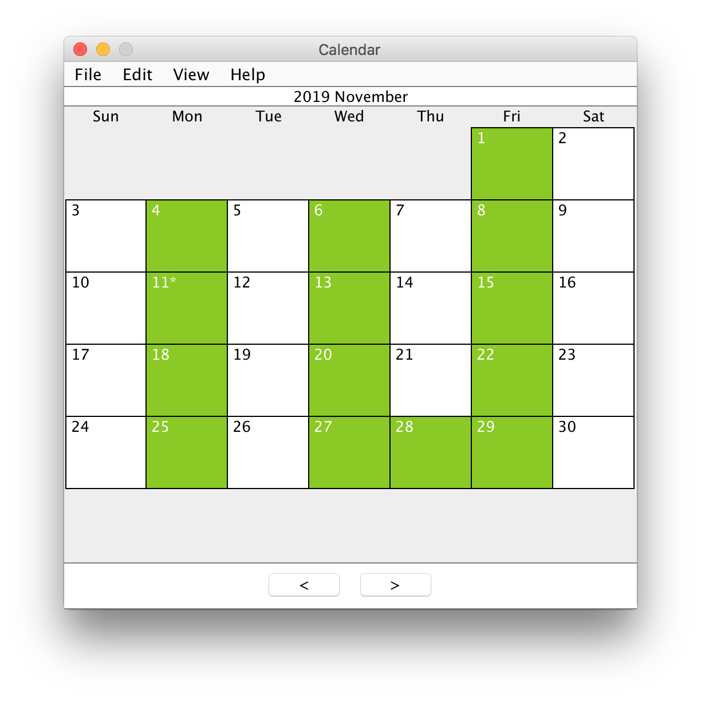

# Calendar App
Created in Java with Swing.

Features:
- A calendar and list display
- Single or repeating event options
- Event creator and editor
- Search for events in range
- Holidays from a [web API](https://date.nager.at/API)
- Saving and loading using [Jackson JSON Library](https://github.com/FasterXML/jackson)
- Changeable settings

Tests created using JUnit.
